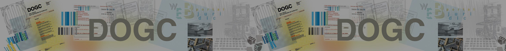

# OPEN-DOGC

What do we know about our politicians? Do we have enough information about what decisions they make? Are journals really telling us everything that should be important?

What if we could analyze the information from official documents in a more efficient way without even need to read what’s inside?

Inspired by the platform opengov.cat, we created this project, where we use python code to go through the official documents published in the website http://dogc.gencat.cat and return information about what these documents are talking about and about which persons are cited in the official documents.

The dogc website is where all official documents from the Catalan government of Generalitat de Catalunya are published. These documents refer to announcements, adjudications, decrees or agreements among others. We focused on those documents labeled as Agreements, as they are related to important decisions taken inside the government.

The project is one of the capstone project of the course Data Science and [Big Data from the Universitat de Barcelona](https://www.ub.edu/web/ub/es/estudis/oferta_formativa/masters_propis/fitxa/I/201911632/index.html).

## Authors 😻

- Alex Abos
- Xisca Pericàs

## Tools 🔨

This project was done using the following tools:

| Tool 	| Purpose 	|
|:----:	|:-------:	|
|   python   	|  main language for development        	|
|   mongoDB   	|  database framework        	|
|   html + D3.js   	|  main visualizations        	|

----

**Note** that this project was done on February 2016, therefore some packages used may no longer exist or may be deprecated.
