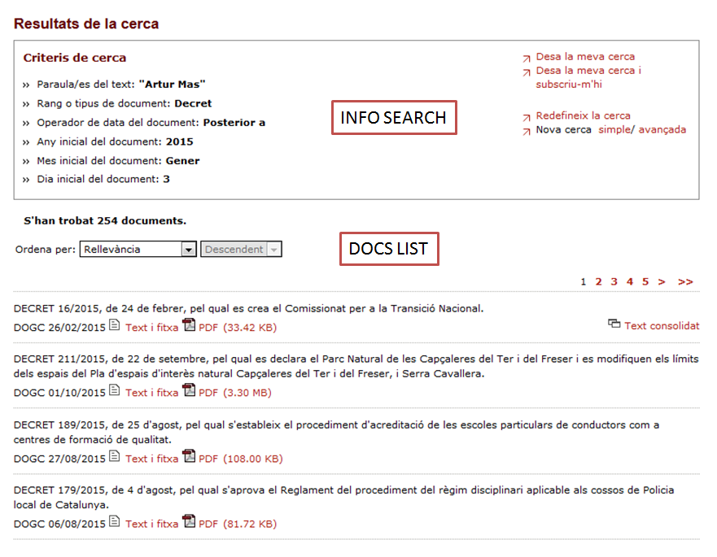
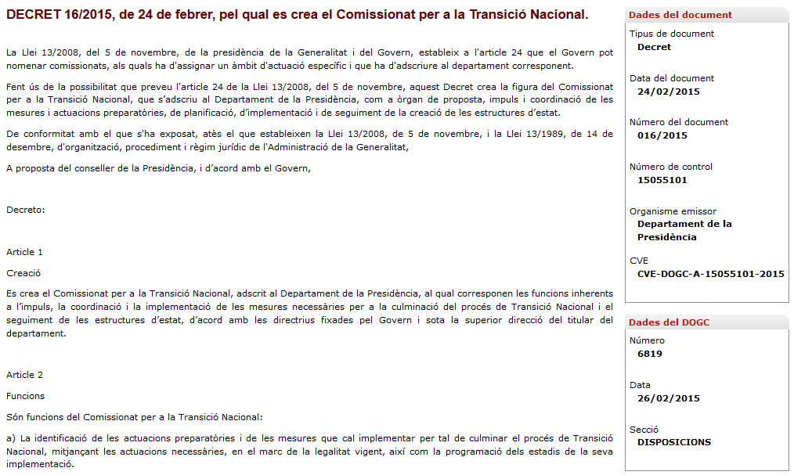
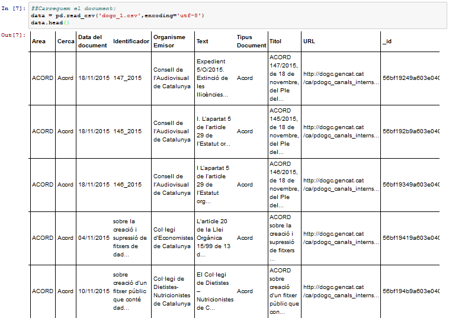

# Scripts

Here you will find all information related with the scripts done for this projects.

## 1. Scrapping 📑

In order to obtain the data to be analyzed, it is necessary to scrap the official documents from the main webpage and store them in a useful format.

The script that can be found inside the scrapping folder, it is splitted into two main phases:

1. Browser into the opengov.cat webpage and navigate up to the advanced search.
2. Iterate upon a list of people (politicians) to get all their available documents.

The browser navigation is performed using **Selenium**, while the database used to store the scrapped information is **MongoDB**.

### 1.1 Advanced Search

In order to get to the advanced search, we need to open a browser using selenium and go to the http://dogc.gencat.cat/ca/ url. Once there, we need to look for the "advanced search" button and click on it.

On the advanced search, we need to find the "searcher" using it's id (*textWorkds*) and introduce our search (for example: Artur Mas). once this is done, we need to click on the searcg button (*cercaAv1*).

Once the search is done, the advanced search will look something similar to the image below:

### 1.2 Get documents and store them

Once we manage to get to results page, we have two types of information:
- Info Search: it gives us information about all the results (keywords, documents type, etc)
- Docs list: it gives us the whole list of documents.

This *Docs List* is what we want to iterate over.

To do so, we get the whole list of results by obtaining the *main_content* table information. Once we have it, we can iterate over each document.

DOGC documents are published in both html and pdf format. In our project, the automatic scraping process was performed using the html files, as they provide easier access to information and also add specific summaries for each document.

For each document, we will get all the text but also the metadata that can be found on the left side of the document page. With this information, we can create a dataframe (from pandas) filled with all needed information: area, search, date, identificatior, issuing agency, text, document type, title and url.

In order to gather better understanding of the information provided by the DOGC documents, we did two kinds of search. Concretely:

- 100 documents per document type (agreements, edicts, decrees and resolutions)
- 50 documents per person (José Montilla, Antoni Castells, Manuela de Madre, Montserrat Tura, Miquel Iceta, Ernest Maragall, Artur Mas, Joana Ortega, Felip Puig, Meritxell Borràs and Oriol Pujol)

These documents were ranked by relevancy prior to their download.

### 1.3 Output

The result of this first step is a mongoDB that contains all the scrapped information. For each document there is a row indexed by the author and the date, with a column for the whole text and columns with the metadata explained before.

## 2. Data processing, cluster using LDA and multi-class classifier 👥

The data analysis of this project is based on the clusterisation of all documents using an unsupervised machine learning model.
Clustering all documents will put together those ones that discuss about similar topics or are defined in a similar way. Once we have the clusters, we can then perform some studies about the participation of each party in each cluster and how they relate.

The script for the clusterization can be found in the 2. Model folder. This script is divided into two main steps:

- Preprocessing: clean the scrapped documents and transform them into a matrix that can be used for the cluster model.
- Cluster model and classification: this is done using LDA (Latent Dirichlet Allocation) with a total of 5 topics.

### 2.1 Preprocessing

The documents need to be cleaned before they can be used as input for the cluster model.
This processing has the following steps:

- **Import data (.csv)**

Data is imported form csv (but it could have also been imported from the mongoDB).

- **Translate to english**

The main DOGC language is Catalan. Catalan is a difficult language to apply cleaning packages of text in python as less text processing tools are available. To solve this problem, we translated all documents to English in order to apply the cleaning techniques available in python. Translation was performed using textblob (http://textblob.readthedocs.org/).

- **Word processing**

This step consist in tokenitzation (split text into single words), remove punctuation marks and reduce words to root (lemmatize).

The python packages to apply these points were numpy, pandas, nltk, string and textblob.

- **Build our dictionary**

This step consist in building a dictionary with all the available words found in all the scrapped text. This dictionary will then be used to build the matrix for the LDA model.

- **Build the MxN matrix**

Once we have the dictionary, we can then convert all text into vector. These vector will containing the times each word of the dictionary appears in the text.
The matrix will have size MxN, being M the number of documents and N the length of the dictionary.
Once this is done, the matrix will be normalized.

### 2.2 LDA Model

Once the text inside each document is cleaned, we applied a topic model to obtain a categorization of documents based in the most frequent words present in them. The topic model used was LDA (Latent Dirichlet Allocation) for python.

LDA is a hierarchical Bayesian model that allows us to create topics from different texts based in the top words present within the texts.
The LDA is a supervised algorithm so we had to establish the number of topics and the number of important words for the classification. After a manual supervision of the results, the final LDA model was created with 5 topics and 10 top words.

Concretely, the 5 topics were classified as:

| Topic 	| Description 	|
|:----:	|:-------:	|
|   Topic 0   	|  Environment and territory        	|
|   Topic 1   	|  Health       	|
|   Topic 2  	|  Employment and Welfare (Social Security)       	|
|   Topic 3  	|  Legal matters      	|
|   Topic 4  	|   Media and audiovisual      	|

### 2.3 Multi-class classification model

Once we have created our own clusters, we can characterize them using the most frequent words on each topic. In our case, we have selected the top 10 words for each topic.

Once we have them, we can use a machine learning multi-class model to verify that the presence of this words in a given text is enough to classify that specific text into a topic.

This is what is done in the scripts/2. model/ML Model OpenDogc.

We have changed our matrix to a new one, this time the dictionary has been created using the top-10 words for each topic. However, instead of doing a count of each word, we just take into account if the word can be found in the text or not (binary matrix).

Once this is done, we split the dataset into train and test set (80-20 parity) and we apply a multi-class classification model, in order to find out the topics label.
We have compared two different algorithm (LinearSVC and LogisticRegression) and we have used the OneVsRestClassifier strategy (which means we create an specific model for each class or topic -positive label- and we label the rest of classes/topics as negative).

The results show an accuracy above 0.9 for both models on the test set, being the LinearSVC slightly better.

This new model can now be applied to new scrapped text and allow us to do some studies relating content, politicians, parties and topics.

## 3. Analysis and visualisation
